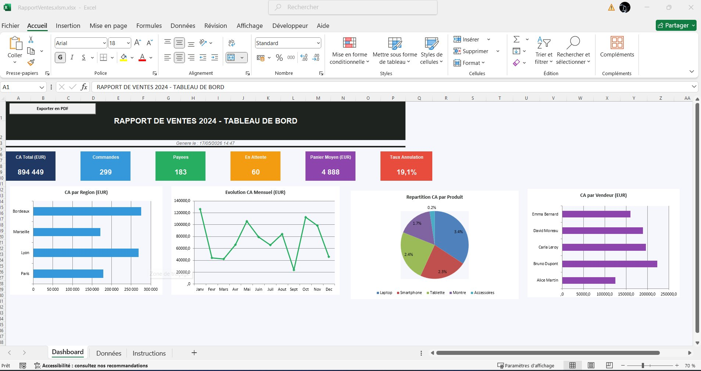
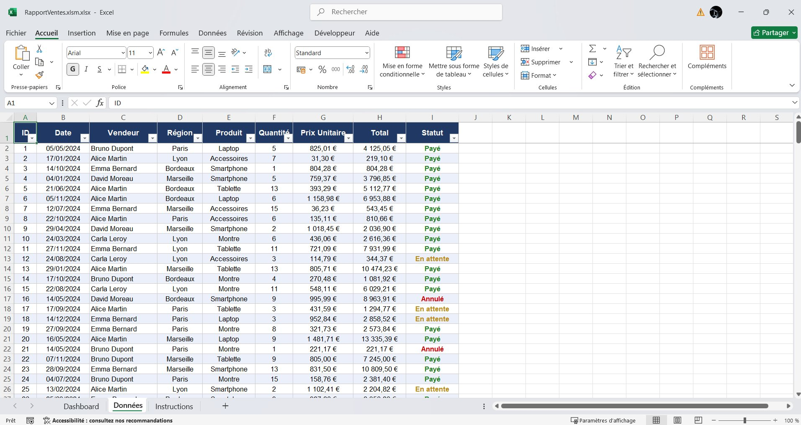
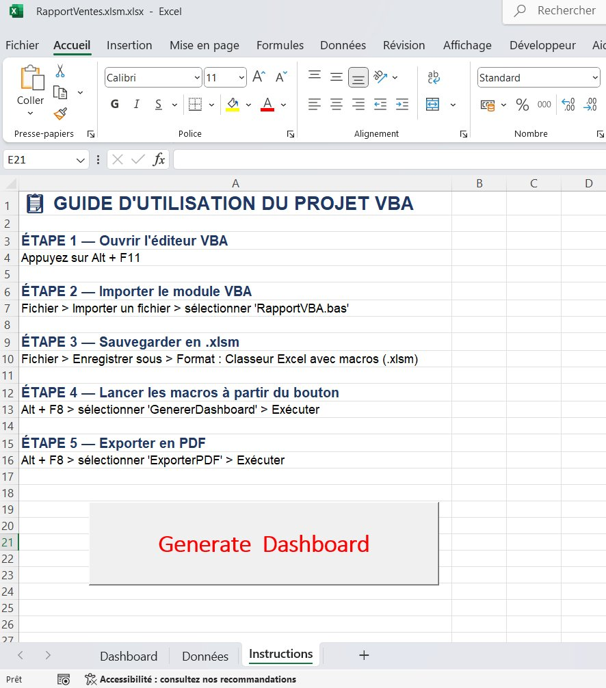
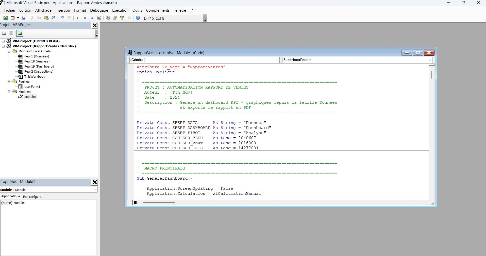

# 📊 VBA Sales Dashboard — Automatisation Rapport de Ventes

> Génération automatique d'un tableau de bord commercial complet et export PDF en un clic, avec VBA et Excel.


---

## 🎯 Présentation

**VBA Sales Dashboard** est une application VBA développée sous Microsoft Excel qui automatise intégralement la production du rapport commercial mensuel. À partir d'une simple liste de ventes, l'outil génère en quelques secondes :

- ✅ Un **dashboard visuel** avec 6 KPI commerciaux
- ✅ **4 graphiques d'analyse** (régions, mois, vendeurs, produits)
- ✅ Un **rapport PDF** prêt à diffuser

Le projet répond à une problématique métier réelle : éliminer le travail manuel récurrent des analystes et contrôleurs de gestion qui consacrent chaque mois plusieurs heures à reconstruire les mêmes tableaux et graphiques.

---

## 🖼️ Aperçu

### Dashboard généré automatiquement


### Feuille de données source


### Guide d'utilisation intégré


### Code source VBA


---

## ⚙️ Fonctionnalités

### 6 KPI calculés automatiquement
| KPI | Description |
|-----|-------------|
| 💰 **CA Total** | Chiffre d'affaires des commandes payées |
| 📦 **Commandes** | Volume total d'activité |
| ✅ **Payées** | Volume converti en CA réel |
| ⏳ **En attente** | Encours à transformer |
| 🛒 **Panier moyen** | CA / nombre de commandes payées |
| ❌ **Taux d'annulation** | Indicateur qualité commerciale |

### 4 graphiques d'analyse
- **CA par Région** — Barres horizontales (Paris, Lyon, Marseille, Bordeaux)
- **Évolution CA Mensuel** — Courbe avec marqueurs (12 mois)
- **CA par Vendeur** — Comparaison des 5 commerciaux
- **Répartition par Produit** — Camembert avec pourcentages

### Export PDF en un clic
- Fichier PDF horodaté (format `Rapport_Ventes_YYYYMMDD_HHMM.pdf`)
- Mise en page A4 paysage
- En-tête et pied de page personnalisés
- Sauvegarde dans le dossier du classeur

---

## 🛠️ Stack technique

| Composant | Technologie |
|-----------|-------------|
| Langage | VBA (Visual Basic for Applications) |
| Plateforme | Microsoft Excel 2016+ |
| Format | `.xlsm` (Classeur avec macros) |
| Sortie | Dashboard Excel + Rapport PDF |

---

## 📁 Architecture

```
VBA-Sales-Dashboard/
│
├── src/
│   └── RapportVentes.bas         # Module VBA principal
│
├── screenshots/                   # Captures d'écran
│   ├── 01_dashboard.png
│   ├── 02_donnees.png
│   ├── 03_instructions.png
│   └── 04_vba_editor.png
│
├── RapportVentes.xlsm             # Classeur Excel avec macros
├── Rapport_VBA_Sales_Dashboard.pdf  # Rapport détaillé du projet
└── README.md                      # Ce fichier
```

### Structure du classeur Excel
- 📋 **Données** — Saisie des ventes brutes (entrée)
- 📊 **Dashboard** — Tableau de bord généré (sortie)
- 🔢 **Analyse** — Calculs intermédiaires (masquée)
- 📖 **Instructions** — Guide d'utilisation

### Structure du module VBA
```vba
Module "RapportVentes"
├── GenererDashboard()      ' Macro principale (orchestrateur)
├── CreerFeuilleAnalyse()   ' Calcul des KPI et agrégats
├── CreerDashboard()        ' Construction visuelle
├── AfficherKPI()           ' Cartes KPI colorées
├── AjouterGraphiqueRegion()
├── AjouterGraphiqueMois()
├── AjouterGraphiqueVendeur()
├── AjouterGraphiqueProduit()
└── ExporterPDF()           ' Export PDF final
```

---

## 🚀 Utilisation

### Prérequis
- Microsoft Excel 2016 ou supérieur
- Macros activées (Fichier → Options → Centre de gestion de la confidentialité)

### Étapes
1. **Ouvrir** `RapportVentes.xlsm` dans Excel
2. **Activer** les macros si Excel le demande
3. **Saisir** les données dans la feuille `Données` (respecter les colonnes A→I)
4. **Aller** sur la feuille `Instructions` et cliquer sur **Generate Dashboard**
5. Le dashboard est généré automatiquement
6. **Cliquer** sur le bouton `Exporter en PDF` pour produire le rapport

### Format de la feuille "Données"
| Col | Champ | Type | Exemple |
|-----|-------|------|---------|
| A | ID | Entier | `1` |
| B | Date | Date | `05/05/2024` |
| C | Vendeur | Texte | `Bruno Dupont` |
| D | Région | Texte | `Paris` |
| E | Produit | Texte | `Laptop` |
| F | Quantité | Entier | `5` |
| G | Prix Unitaire | Décimal | `825.01` |
| H | Total | Décimal | `4125.05` |
| I | Statut | Texte | `Payé` / `En attente` / `Annulé` |

---

## 🧠 Bonnes pratiques mises en œuvre

- ✅ **`Option Explicit`** — Déclaration obligatoire des variables
- ✅ **Constantes globales** centralisées pour la maintenance
- ✅ **Gestion d'erreur** structurée (`On Error GoTo`)
- ✅ **Optimisation perf** (désactivation `ScreenUpdating`, `Calculation`, `EnableEvents`)
- ✅ **Modularité** — Une responsabilité par sous-procédure
- ✅ **Validation** — Vérification de l'existence des feuilles avant traitement
- ✅ **Plage dynamique** — Détection automatique du nombre de lignes
- ✅ **Code commenté** — Sections délimitées et documentées

---

## 📦 Installation du module dans un autre classeur

Si tu veux utiliser le module dans ton propre fichier Excel :

1. Ouvrir l'éditeur VBA : `Alt + F11`
2. `Fichier` → `Importer un fichier` → sélectionner `src/RapportVentes.bas`
3. Enregistrer le classeur au format `.xlsm`
4. S'assurer que la feuille source s'appelle bien `Données` avec les colonnes A→I
5. Lancer la macro `GenererDashboard` via `Alt + F8`

---

## 🔮 Améliorations futures

- [ ] Listes dynamiques (détecter régions/vendeurs/produits depuis les données)
- [ ] UserForm de saisie guidée des commandes
- [ ] Tableaux croisés dynamiques natifs (au lieu de `SUMPRODUCT`)
- [ ] Comparaison N vs N-1 avec calcul d'évolution
- [ ] Envoi automatique du PDF par mail via Outlook
- [ ] Filtre multi-année dans le dashboard
- [ ] Drill-down interactif sur les graphiques

---

## 📄 Rapport détaillé

Un rapport PDF complet du projet est disponible : [`Rapport_VBA_Sales_Dashboard.pdf`](./Rapport_VBA_Sales_Dashboard.pdf)

Il couvre la problématique, l'architecture, le détail technique, les bonnes pratiques et les compétences démontrées.

---

## 👤 Auteur

**Souheil** — Projet réalisé dans une démarche de démonstration de compétences en automatisation bureautique, VBA et analyse de données.

---

## 📝 Licence

MIT
